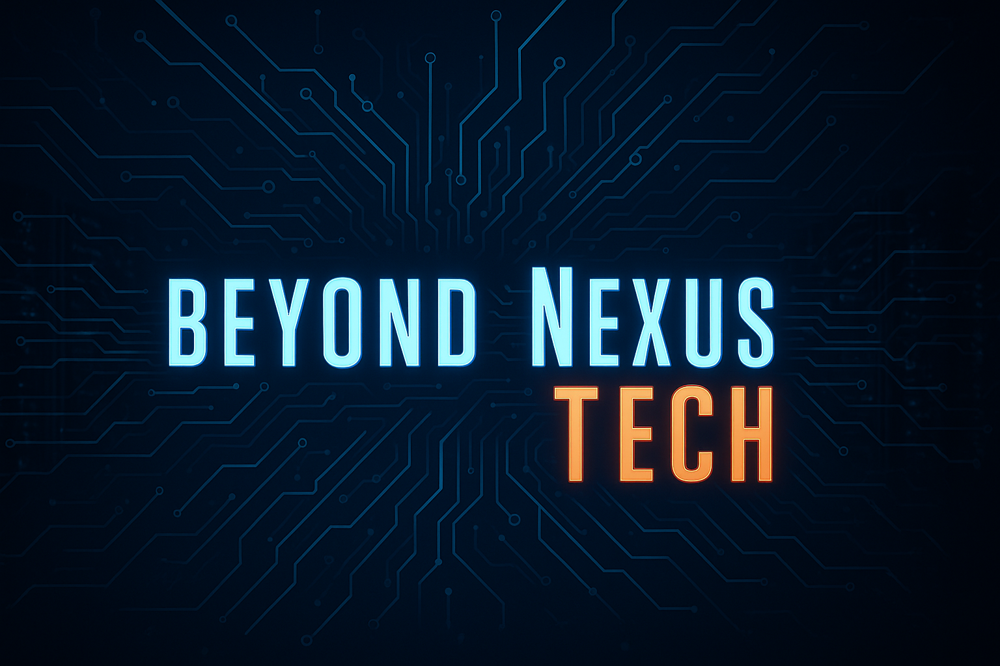
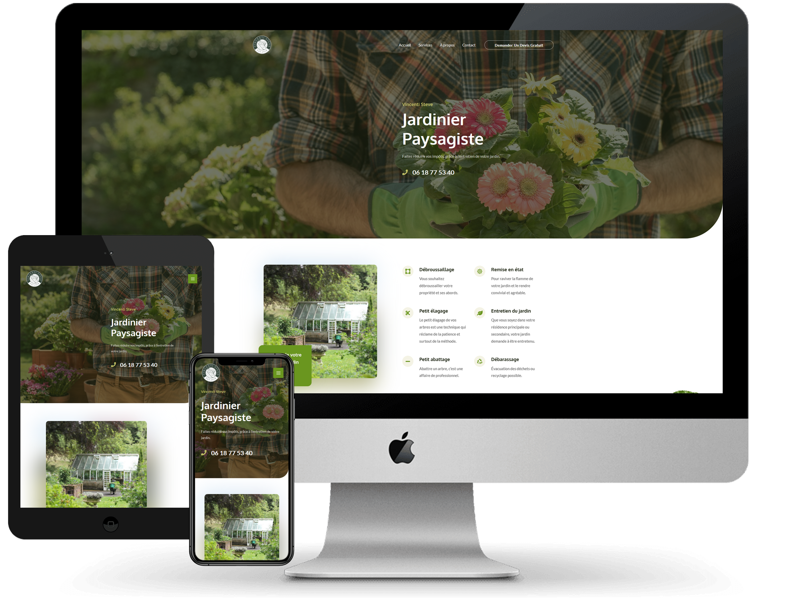
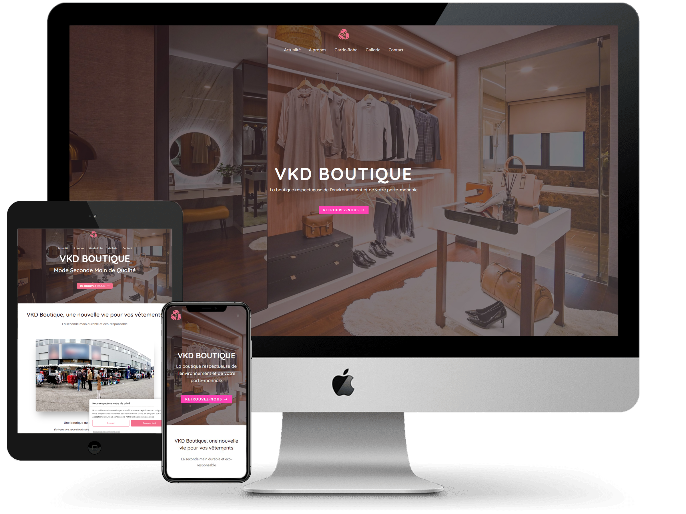
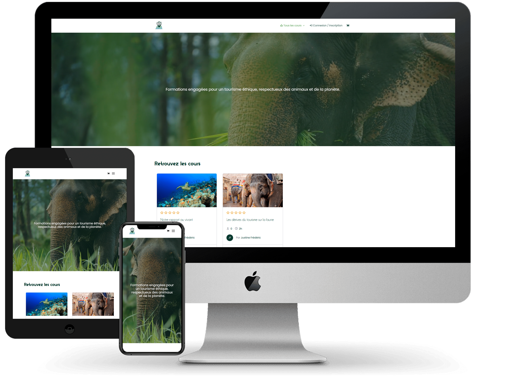
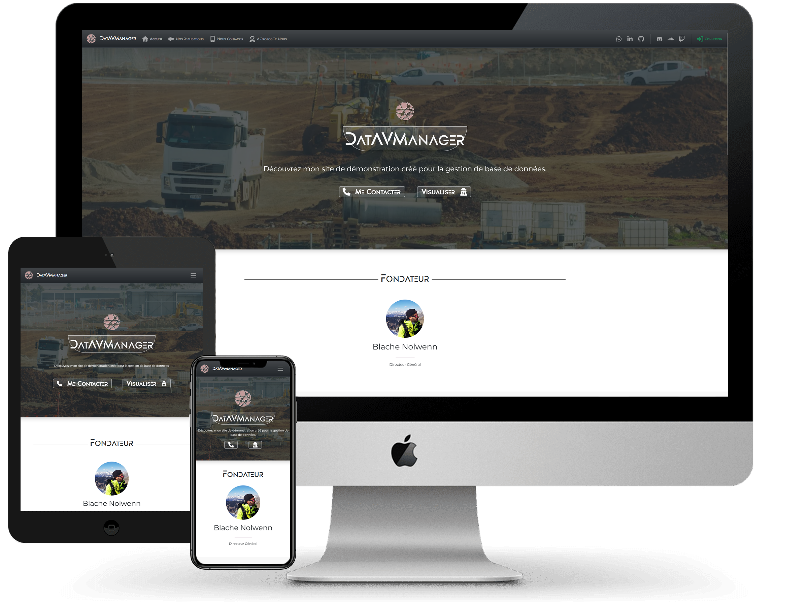
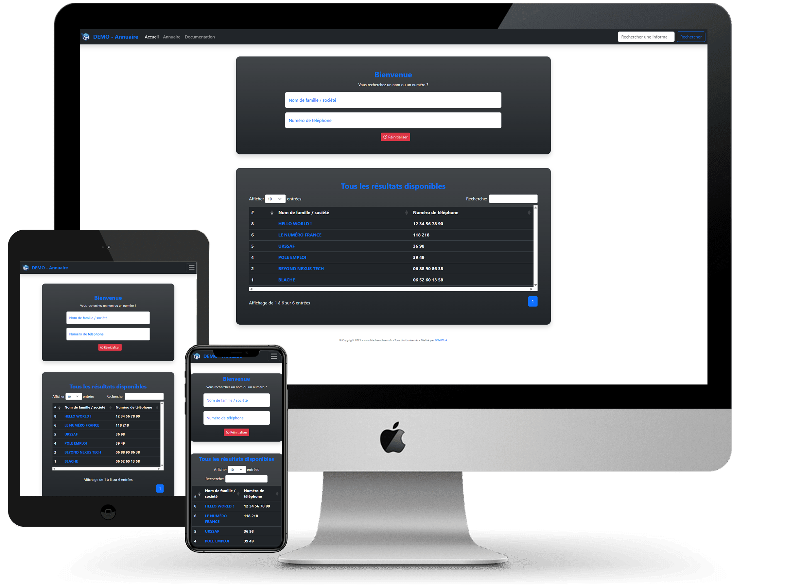
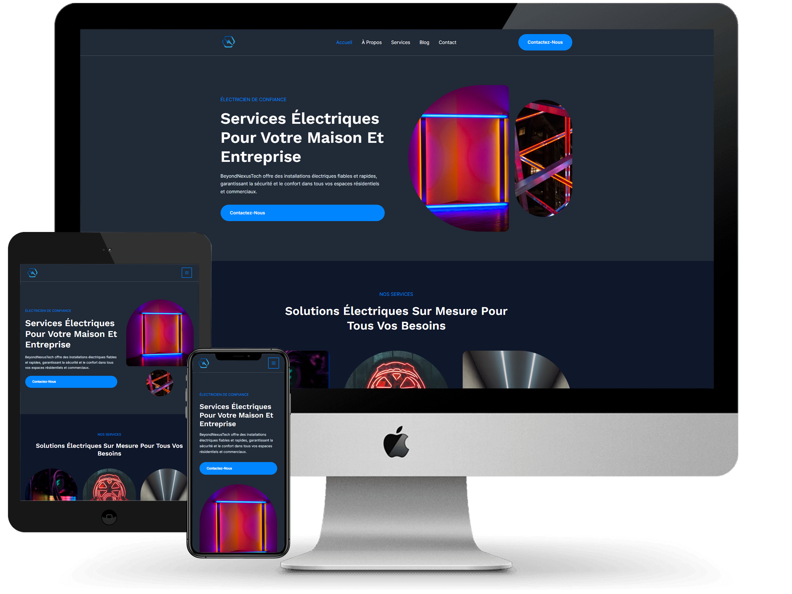
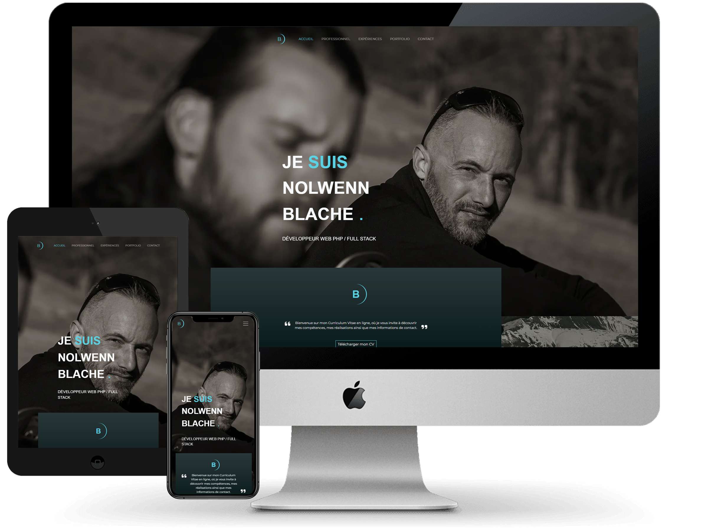
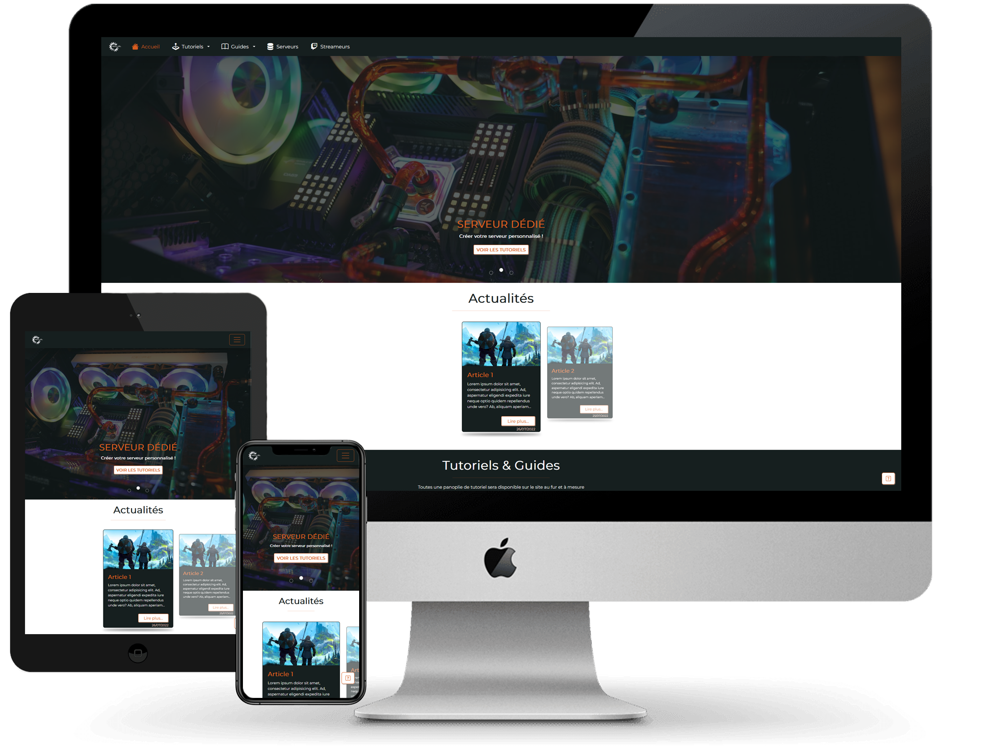

    

<h1 align="center">BeyondNexusTech</h1>

    Développement Web Full Stack – PHP, Symfony, MySQL 
    <strong>Innovation, performance et accompagnement personnalisé</strong>

 

Bienvenue sur le dépôt GitHub de **BeyondNexusTech**, auto-entrepreneur spécialisé dans le développement web full stack PHP.
Avec une expertise avérée dans la création de solutions web sur mesure, j'accompagne les entreprises dans la transformation de leurs idées en projets digitaux performants.

---

## 🎯 Mission et Valeurs

Ma mission est de fournir des solutions web de haute qualité qui aident les entreprises à réussir dans le monde numérique. Je transforme vos idées en projets concrets et performants, en mettant l'accent sur la transparence, l'engagement et l'innovation.

- **Excellence** : S'efforcer d'atteindre les plus hauts standards de qualité.
- **Innovation** : Appliquer des solutions créatives et modernes.
- **Transparence** : Communication claire à chaque étape.
- **Engagement** : Dévouement et passion au service de vos projets.

---

## 🛠️ Compétences

- Développement **front-end** (HTML, CSS, JavaScript, Tailwind)
- Développement **back-end** (PHP, Symfony, API REST)
- Gestion de bases de données **MySQL** / **PostgreSQL**
- Optimisation de performance, sécurité et SEO
- Intégration d’APIs externes (Twitch, Spotify, Discord, etc.)
- Automatisation, cronjobs, dashboard, interfaces de gestion
- Hébergement auto-géré (Ubuntu Server, Docker, Nginx)

---

## 🚀 **Projets & Réalisation**

### 🧑‍💼 Sites professionnels

- <h4>
    <a href="https://www.proximojardin.beyondnexus.fr">🌿 ProximoJardin</a>
</h4>

 
Site vitrine pour un jardinier local acceptant le CESU

- <h4>
    <a href="https://www.vkd.beyondnexus.fr">🛍️ VKD Boutique</a>
</h4>

 
Site vitrine pour une boutique ambulante sur marché

 

### 📚 Plateformes pédagogiques et commerciales

- <h4>
    <a href="https://www.aniwell-travel.fr">🌍 Aniwell Travel</a>
</h4>

 
Cours en ligne & réservations d’activités éthiques 🎓 Intégration WordPress multisite avec TutorLMS, Amelia & WooCommerce.

 

### ⚙️ Applications de gestion

- <h4>
    <a href="https://www.demo.data-manager.blache-nolwenn.fr">📁 DataManager</a>
</h4>

 
Gestion de flottes, employés, factures & CA

 

- <h4>
    <a href="https://www.demo.phone-book.blache-nolwenn.fr">☎️ PhoneBook</a>
</h4>

 
Annuaire interactif CRUD + recherche dynamique

 

### 🖥️ Projets personnels & techniques

- <h4>
    <a href="https://www.energy.beyondnexus.fr">⚡ BeyondNexusTech Energy</a>
</h4>

 
Site de présentation pour activités électriques (EI)

 

- <h4>
    <a href="https://www.cb.blache-nolwenn.fr">🔧 Curriculum Vitae</a>
</h4>

 
CV interactif 100% custom PHP

 

- <h4>
    <a href="https://www.neshkel.fr">🎮 Neshkel</a>
</h4>

 
Widget Twitch + outils pour streamers & joueurs

 

- 🤖 Discord bot Python (multi-serveur, dashboard et intégrations API)
- 🔐 Création de serveur local et attribution de signature électronique auto-signée pour hébergement web et serveur de jeu vidéo

---

## 🏆 Distinctions

- **📚 Autodidacte** : Expertise acquise sans formation formelle, à travers passion, rigueur et projets.
- **🏆 Trophée Action Co 2023 pour Ford** : Prix d'innovation web pour un projet stratégique d’optimisation digitale.

---

## 📬 Contact

Pour toute demande de collaboration ou de projet :

📧 **[contact@beyondnexus.fr](mailto:contact@beyondnexus.fr)**  
🌐 **[beyondnexus.fr](https://www.beyondnexus.fr)**

---

## 🔗 Suivre mon activité

- [LinkedIn – BLACHE Nolwenn](https://www.linkedin.com/in/bn-web)

---

Merci pour votre visite sur mon dépôt GitHub ! 🙌
